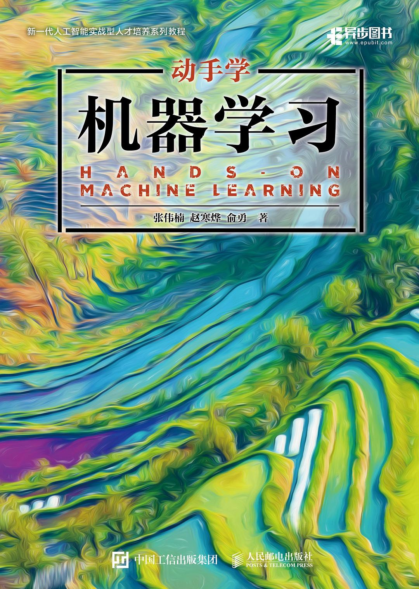

# 《动手学机器学习》习题解答
  
[《动手学机器学习》](https://hml.boyuai.com/)是上海交通大学俞勇教授团队的张伟楠副教授，赵寒烨博士，俞勇教授编写一本机器学习的精品书籍。这本书是理论与实践相结合的一本书籍，既提供了尽可能清晰的机器学习基础讲解，又提供了详细可运行的代码案例，能帮助学习者对讲述的理论和机器学习代码有更深刻的理解。  

<div align="center">
    
</div>

## 使用说明
本项目对《动手学机器学习》习题部分进行解答，主要完成了该书的所有习题解答，包括提供可运行的代码，作为该书习题的参考手册，帮助学习者更加深入地理解和应用书中的知识。  

**本项目的最佳使用方法是在独立尝试完成课后习题后，如遇到不会的或不确定的，再来查阅习题解答。**  
如果觉得解答不详细、存在错误或有疑问，请[点击这里](https://github.com/motewei/Hands-on-ML-solutions/issues)提交您建议，我们看到后会尽快修改或答复。

### 在线阅读地址
在线阅读地址：https://datawhalechina.github.io/hml-solutions/

### Notebook运行
本项目提供了每个章节习题解答的jupyter notebook版本，包括相关的可运行的代码，只需克隆项目到本地即可使用。  
1. 克隆项目请使用如下命令
    ```shell
    git clone https://github.com/datawhalechina/hml-solutions.git
    ```
      
2. python和相关依赖包版本
   本项目和书籍相关代码所使用的python及其相关依赖包均无版本限制
  
3. docsify框架运行
    ```shell
    docsify serve ./docs
    ```


## 目录
  * [第2章 机器学习的数学基础](./docs/第2章%20机器学习的数学基础/ch02.md)
  * [第3章 k近邻算法](./docs/第3章%20k近邻算法/ch03.md)
  * [第4章 线性回归](./docs/第4章%20线性回归/ch04.md)
  * [第5章 机器学习的基本思想](./docs/第5章%20机器学习的基本思想/ch05.md)
  * [第6章 逻辑斯谛回归](./docs/第6章%20逻辑斯谛回归/ch06.md)
  * [第7章 双线性模型](./docs/第7章%20双线性模型/ch07.md)
  * [第8章 神经网络与多层感知机](./docs/第8章%20神经网络与多层感知机/ch08.md)
  * [第9章 卷积神经网络](./docs/第9章%20卷积神经网络/ch09.md)
  * [第10章 循环神经网络](./docs/第10章%20循环神经网络/ch10.md)
  * [第11章 支持向量机](./docs/第11章%20支持向量机/ch11.md)
  * [第12章 决策树](./docs/第12章%20决策树/ch12.md)
  * [第13章 集成学习与梯度提升决策树](./docs/第13章%20集成学习与梯度提升决策树/ch13.md)
  * [第14章 k均值聚类](./docs/第14章%20k均值聚类/ch14.md)
  * [第15章 主成分分析](./docs/第15章%20主成分分析/ch15.md)
  * [第16章 概率图模型](./docs/第16章%20概率图模型/ch16.md)
  * [第17章 EM算法](./docs/第17章%20EM算法/ch17.md)
  * [第18章 自动编码器](./docs/第18章%20自动编码器/ch18.md)


## 项目结构
<pre>
docs-----------------------------------------------习题解答
notebook-------------------------------------------习题解答JupyterNotebook格式
</pre>


## 贡献者名单
| 姓名 | 职责 | 简介 |
| :---| :---| :--- |
| [魏庆伟](https://github.com/motewei) | 项目负责人，第8、15、18章贡献者 | Datawhale 成员|
| [陈辅元](https://github.com/Fuyuan-bit)| 第16、17章贡献者 | Datawhale 成员|
| [谢彩承](https://github.com/YoungBossX)| 第4、11章贡献者 | Datawhale 意向成员，杭州电子科技大学研究生|
| [白雪城](https://github.com/JackBaixue)| 第3、10章贡献者 | Datawhale 成员，沈阳理工大学研究生|
| [王莹莹](https://github.com/fuyueagain)| 第7、14章贡献者 ||
| [晏萌](https://github.com/ym-kyeV1016)| 第2、9章贡献者 | 福州大学|
| [蔡鋆捷](https://github.com/xinala-781)| 第6、13章贡献者 | 福州大学|
| [陈睿](https://github.com/riannyway)| 第5、12章贡献者 | |
> 排名不分先后


## 参考文献/资料
- [《动手学机器学习》](https://hml.boyuai.com/books/)
- [上海交通大学机器学习课—张伟楠教授授课](https://space.bilibili.com/3546754433681656/lists/4008986?type=season)
- [《动手学机器学习》官方代码库](https://github.com/boyu-ai/Hands-on-ML)
- [动手学深度学习习题解答](https://github.com/datawhalechina/d2l-ai-solutions-manual/tree/master/docs)


## 关注我们
<div align=center>
<p>扫描下方二维码关注公众号：Datawhale</p>

</div>
&emsp;&emsp;Datawhale，一个专注于AI领域的学习圈子。初衷是for the learner，和学习者一起成长。目前加入学习社群的人数已经数千人，组织了机器学习，深度学习，数据分析，数据挖掘，爬虫，编程，统计学，Mysql，数据竞赛等多个领域的内容学习，微信搜索公众号Datawhale可以加入我们。


## LICENSE

<a rel="license" href="http://creativecommons.org/licenses/by-nc-sa/4.0/"></a><br />本作品采用<a rel="license" href="http://creativecommons.org/licenses/by-nc-sa/4.0/">知识共享署名-非商业性使用-相同方式共享 4.0 国际许可协议</a>进行许可。