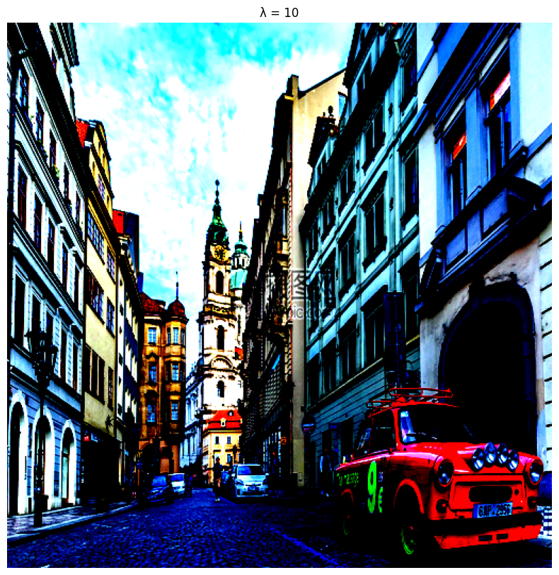
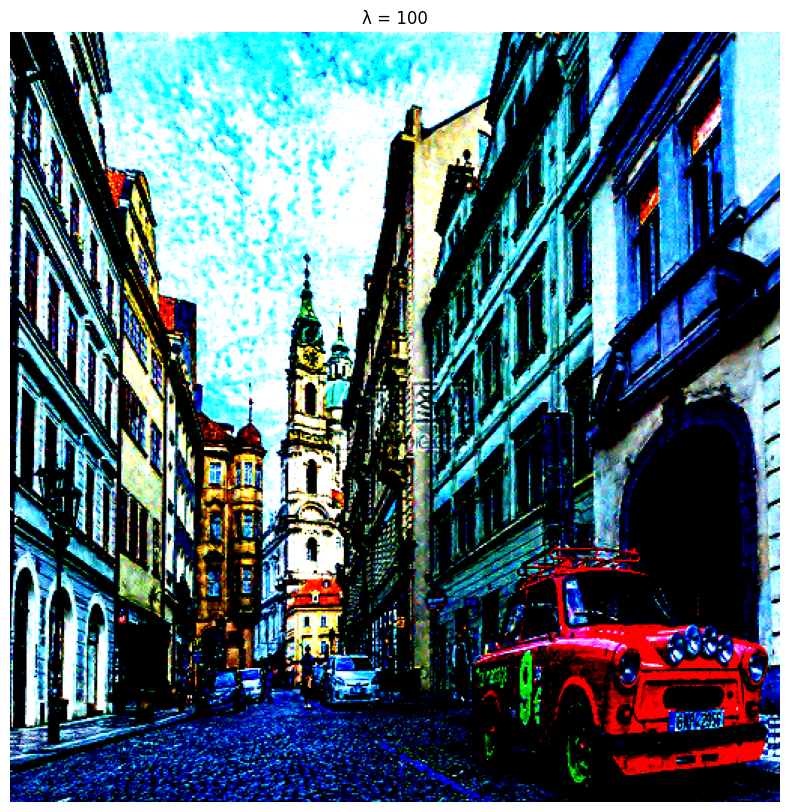
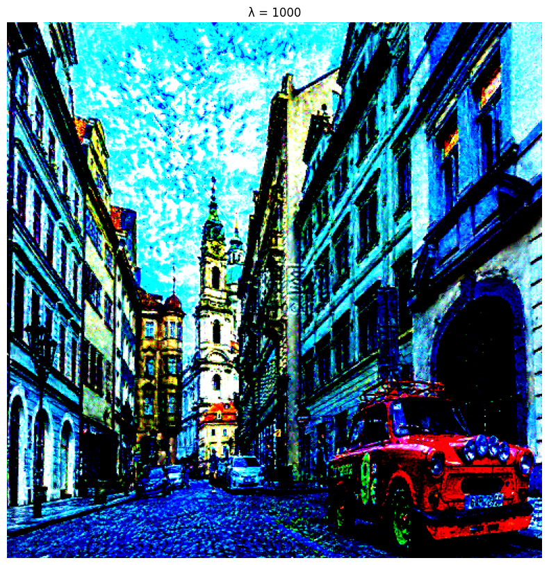
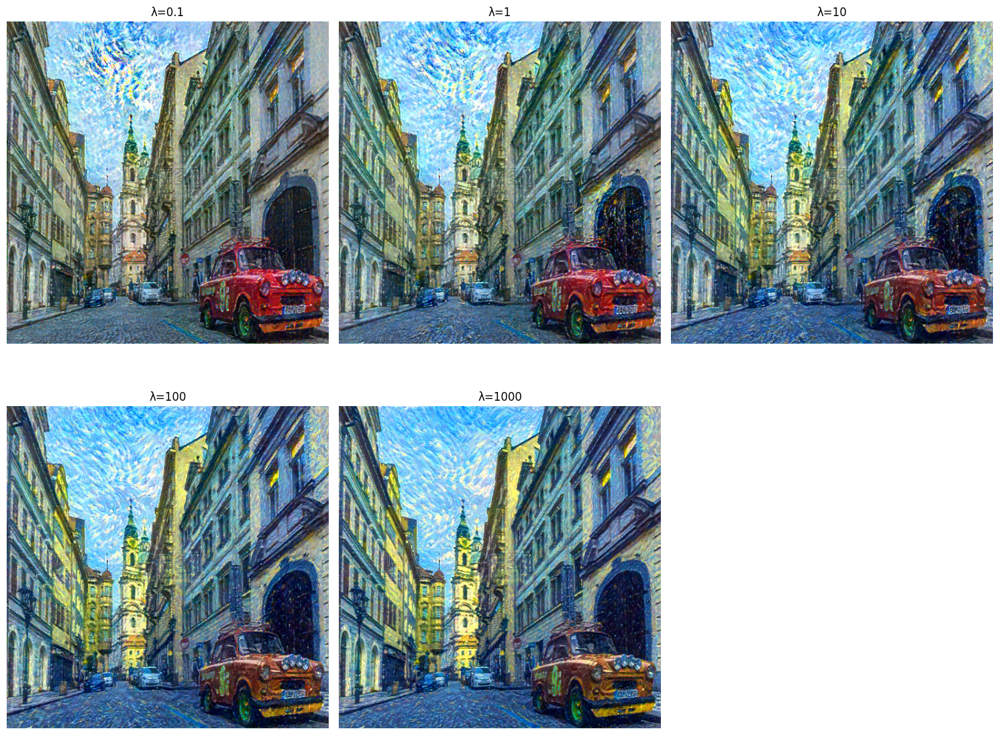

# 卷积神经网络

1. 以下关于CNN的说法正确的是： 

A. 卷积运算考虑了二维的空间信息，所以CNN只能用来完成图像相关的任务。 

B. 池化操作进行了降采样，将会丢弃部分信息，影响模型效果。 

C. 由卷积层得到的特征也需要经过非线性激活函数，来提升模型的表达能力。 

D. 填充操作虽然保持了输出的尺寸，但是引入了与输入无关的信息，干扰特征提取。

**答案：C **

**解析：**

**选项 A**

- 文档明确指出：“CNN 并非只能应用在图像任务上，只要是具有空间关联的输入，都可以通过 CNN 来提取特征。” 因此，CNN 的应用不限于图像任务，A 错误。

**选项 B**

- 池化操作确实通过降采样减少冗余信息，但文档强调其目的是 “降低整体的复杂度”，并未提及 “影响效果”。相反，池化有助于缓解过拟合，B 错误。

**选项 C**

- 文档提到：“在适当的位置我们会插入非线性激活函数。非线性变换可以增加数据维度，提升模型的表达能力。” 因此，卷积层后的激活函数是必要的，C 正确。

**选项 D**

- 填充操作的目的是 “抵消卷积对图像尺寸的影响”，文档未提到其 “引入无关信息”。相反，合理的填充（如全零填充）是标准操作，D 错误。


___

2. 以下关于CNN中卷积层和池化层的描述正确的是： 

A. 卷积层和池化层必须交替出现。 

B. 池化层只有最大池化和平均池化两种。 

C. 池化层的主要目的之一是为了减少计算复杂度。 

D. 卷积层中有许多不同的卷积核，每个卷积核在输入的一部分区域上做运算，合起来覆盖完整的输入。

**答案：C **

**解析：**

**选项 A**
- 文档提到卷积和池化常交替使用（如 LeNet-5 和 AlexNet），但未强制要求必须交替。例如，AlexNet 中存在连续两个卷积层后接一个池化层的结构（图 9-8）。因此，“必须” 表述错误，A 错误。

**选项 B**
- 文档指出 “常用的池化有平均池化和最大池化两种”，但未明确排除其他类型（如随机池化）。因此，“只有” 表述不准确，B 错误。

**选项 C**
- 文档明确说明池化是 “降采样操作”，目的是 “降低整体的复杂度”，因此 C 正确。

**选项 D**
- 卷积核在输入图像上滑动，每个卷积核覆盖整个输入区域（如步长为 1 时），而非 “一部分区域”。例如，3×3 卷积核会逐像素滑动，覆盖全部区域。因此，D 错误。

___

3. CNN的卷积层中还有一个常用参数是步长（stride），表示计算卷积时，卷积核每次移动的距离。在图9 - 5的示例中，卷积核每次移动一格，步长为1，它的左上角经过(0,0)至(2,2)共9个点。如果将步长改为2，卷积核每次移动两格，左上角只经过(0,0),(0,2),(2,0),(2,2)共4个点，以此类推。假设输入宽为$W$，在宽度方向填充长度$W_p$。卷积核宽为$W_k$，在宽度方向的步长为$W_s$。假设所有除法都可以整除，推导卷积后输出矩阵的宽度$W_{out}$。

**答案：**

**数学推导过程**

1. **输入宽度**：$W$  

2. **宽度方向填充长度**:$W_p$（两侧各填充$W_p$，总填充$2W_p$）  

3. **卷积核宽度**：$W_k$

4. **步长**：$W_s$  

**输出宽度公式**：  
$$
W_{\text{out}} = \frac{W + 2W_p - W_k}{W_s} + 1
$$

**推导过程**：  

- 填充后总宽度为$W + 2W_p$。  

- 卷积核滑动覆盖的有效区域长度为$W + 2W_p - W_k$。  

- 滑动次数为$\frac{W + 2W_p - W_k}{W_s}$。  

- 输出宽度为滑动次数加 1（包含起点）。

**验证**

- **示例**：  
  - 输入宽度 \( W = 5 \)，填充 \( W_p = 0 \)，卷积核宽度 \( W_k = 3 \)，步长 \( W_s = 1 \)。  
  - 代入公式：  
    $$
    W_{\text{out}} = \frac{5 + 0 - 3}{1} + 1 = 2 + 1 = 3.
    $$ 
  - 输出宽度为 3，对应 3×3 矩阵（共 9 个点）。

- **步长改为 2**：  
  - 代入公式：  
    $$
    W_{\text{out}} = \frac{5 + 0 - 3}{2} + 1 = 1 + 1 = 2.
    $$ 
  - 输出宽度为 2，对应 2×2 矩阵（共 4 个点）。

最终卷积后输出矩阵的宽度为：  
$$
\boxed{W_{\text{out}} = \frac{W + 2W_p - W_k}{W_s} + 1}
$$


___

4. 试调整上述AlexNet网络的层数、卷积核的大小和数量、丢弃率等设置，观察其训练性能的改变。

**答案**

| **调整项**               | **原始设置**       | **变体设置**       | **预期影响**                                                                 |
|--------------------------|--------------------|--------------------|-----------------------------------------------------------------------------|
| 卷积核大小               | 11×11（第一层）    | 7×7（第一层）      | 减少感受野，可能提升局部特征敏感性，但降低全局信息捕获能力。               |
| 卷积核数量               | 96（第一层）       | 128（第一层）      | 增加特征多样性，可能提升准确率，但增加计算量。                            |
| 卷积层层数               | 5层                | 5层（结构精简）    | 减少冗余计算，可能加快训练速度，但可能损失深层特征。                      |
| 丢弃率                   | 0.5                | 0.7                | 更高的正则化，可能减少过拟合，但可能导致训练初期准确率下降。              |

**实践代码如下**

___


```python
import torch
import torch.nn as nn
import torch.nn.functional as F
from torchvision.datasets import CIFAR10
from torch.utils.data import DataLoader
import torchvision.transforms as transforms
from tqdm import tqdm  

# 自定义调整后的AlexNet网络
class ModifiedAlexNet(nn.Module):
    def __init__(self, num_classes=10):
        super(ModifiedAlexNet, self).__init__()
        # 调整卷积层配置（示例：增加一层卷积，改变卷积核数量）
        self.conv1 = nn.Conv2d(3, 64, kernel_size=5, padding=2)  # 5x5卷积核，通道翻倍
        self.conv2 = nn.Conv2d(64, 64, kernel_size=3, padding=1)
        self.conv3 = nn.Conv2d(64, 128, kernel_size=3, padding=1)  # 新增卷积层
        self.pooling1 = nn.MaxPool2d(2)
        
        self.conv4 = nn.Conv2d(128, 128, kernel_size=3, padding=1)
        self.conv5 = nn.Conv2d(128, 256, kernel_size=3, padding=1)
        self.pooling2 = nn.MaxPool2d(2)
        
        # 调整丢弃率（示例：增加dropout强度）
        self.dropout1 = nn.Dropout(0.3)
        self.dropout2 = nn.Dropout(0.4)
        
        # 全连接层调整（根据特征图尺寸重新计算输入维度）
        # 假设输入32x32，经过两次池化后尺寸：32 -> 16 -> 8
        # 通道数：256
        self.fc1 = nn.Linear(256 * 8 * 8, 1024)  # 增加全连接层宽度
        self.dropout3 = nn.Dropout(0.6)
        self.fc2 = nn.Linear(1024, num_classes)

    def forward(self, x):
        x = F.relu(self.conv1(x))
        x = F.relu(self.conv2(x))
        x = self.pooling1(x)
        x = self.dropout1(x)
        
        x = F.relu(self.conv3(x))
        x = F.relu(self.conv4(x))
        x = F.relu(self.conv5(x))
        x = self.pooling2(x)
        x = self.dropout2(x)
        
        x = x.view(x.size(0), -1)
        x = F.relu(self.fc1(x))
        x = self.dropout3(x)
        x = self.fc2(x)
        return x

# 数据加载与预处理
transform = transforms.Compose([
    transforms.ToTensor(),
    transforms.Normalize((0.5, 0.5, 0.5), (0.5, 0.5, 0.5))
])

trainset = CIFAR10(root='./cifar10', train=True, download=True, transform=transform)
testset = CIFAR10(root='./cifar10', train=False, download=True, transform=transform)
trainloader = DataLoader(trainset, batch_size=128, shuffle=True)
testloader = DataLoader(testset, batch_size=128, shuffle=False)


# 初始化模型与训练配置
device = torch.device("cuda" if torch.cuda.is_available() else "cpu")
print(f"Using {device} device | CUDA: {torch.cuda.device_count()}")
model = ModifiedAlexNet().to(device)  # 模型移动到GPU
optimizer = torch.optim.Adam(model.parameters(), lr=1e-3)
criterion = nn.CrossEntropyLoss().to(device)  # 损失函数移动到GPU

epochs = 5
for epoch in range(epochs):
    # 训练阶段
    model.train()
    train_loss = 0.0
    train_correct = 0
    train_total = 0
    
    train_pbar = tqdm(trainloader, desc=f'Epoch {epoch+1}/{epochs} Train', 
                      bar_format='{l_bar}{bar:10}{r_bar}{bar:-10b}')
    for inputs, labels in train_pbar:
        # 数据移动到GPU（关键优化）
        inputs = inputs.to(device, non_blocking=True)
        labels = labels.to(device, non_blocking=True)
        
        optimizer.zero_grad()
        outputs = model(inputs)
        loss = criterion(outputs, labels)
        loss.backward()
        optimizer.step()
        
        # 统计指标（GPU上的张量操作）
        train_loss += loss.item()
        _, predicted = outputs.max(1)
        train_correct += predicted.eq(labels).sum().item()  # .eq()在GPU上计算
        train_total += labels.size(0)
        
        train_pbar.set_postfix({
            'Loss': f'{train_loss/(train_pbar.n+1):.4f}',
            'Acc': f'{train_correct/train_total:.4f}'
        })
    
    # 验证阶段
    model.eval()
    test_loss = 0.0
    test_correct = 0
    test_total = 0
    
    test_pbar = tqdm(testloader, desc=f'Epoch {epoch+1}/{epochs} Test', 
                     bar_format='{l_bar}{bar:10}{r_bar}{bar:-10b}')
    with torch.no_grad():
        for inputs, labels in test_pbar:
            inputs = inputs.to(device, non_blocking=True)
            labels = labels.to(device, non_blocking=True)
            
            outputs = model(inputs)
            loss = criterion(outputs, labels)
            
            test_loss += loss.item()
            _, predicted = outputs.max(1)
            test_correct += predicted.eq(labels).sum().item()
            test_total += labels.size(0)
            
            test_pbar.set_postfix({
                'Loss': f'{test_loss/(test_pbar.n+1):.4f}',
                'Acc': f'{test_correct/test_total:.4f}'
            })
    
    print(f'\nEpoch {epoch+1} Summary | '
          f'Train Acc: {train_correct/train_total:.4f} | '
          f'Test Acc: {test_correct/test_total:.4f}\n')
```

    Files already downloaded and verified
    Files already downloaded and verified
    Using cuda device | CUDA: 1
    

    Epoch 1/5 Train: 100%|██████████| 391/391 [01:02<00:00,  6.23it/s, Loss=1.5808, Acc=0.4150]                            
    Epoch 1/5 Test: 100%|██████████| 79/79 [00:06<00:00, 11.83it/s, Loss=1.1775, Acc=0.5705]                               
    

    
    Epoch 1 Summary | Train Acc: 0.4150 | Test Acc: 0.5705
    
    

    Epoch 2/5 Train: 100%|██████████| 391/391 [01:00<00:00,  6.43it/s, Loss=1.1390, Acc=0.5922]                            
    Epoch 2/5 Test: 100%|██████████| 79/79 [00:06<00:00, 11.71it/s, Loss=0.9982, Acc=0.6462]                               
    

    
    Epoch 2 Summary | Train Acc: 0.5922 | Test Acc: 0.6462
    
    

    Epoch 3/5 Train: 100%|██████████| 391/391 [01:00<00:00,  6.44it/s, Loss=0.9428, Acc=0.6684]                            
    Epoch 3/5 Test: 100%|██████████| 79/79 [00:06<00:00, 11.76it/s, Loss=0.8497, Acc=0.7057]                               
    

    
    Epoch 3 Summary | Train Acc: 0.6684 | Test Acc: 0.7057
    
    

    Epoch 4/5 Train: 100%|██████████| 391/391 [01:00<00:00,  6.42it/s, Loss=0.8169, Acc=0.7117]                            
    Epoch 4/5 Test: 100%|██████████| 79/79 [00:06<00:00, 12.05it/s, Loss=0.7286, Acc=0.7452]                               
    

    
    Epoch 4 Summary | Train Acc: 0.7117 | Test Acc: 0.7452
    
    

    Epoch 5/5 Train: 100%|██████████| 391/391 [01:00<00:00,  6.42it/s, Loss=0.7309, Acc=0.7426]                            
    Epoch 5/5 Test: 100%|██████████| 79/79 [00:06<00:00, 11.74it/s, Loss=0.6939, Acc=0.7579]                               

    
    Epoch 5 Summary | Train Acc: 0.7426 | Test Acc: 0.7579
    
    

    
    

5. 试调整图像色彩风格迁移中的$\lambda$权重，也即修改代码中`lbd`的取值，观察输出图像的变化。

**答案**

| λ值 | 效果描述 |
| ---- | ---- |
| 0.1 | 风格主导，生成图像接近《星月夜》的笔触和色彩。 |
| 1 | 风格与内容平衡，既有星月夜的风格，又保留了内容图像的轮廓。 |
| 10 | 内容主导，风格影响减弱，生成图像更接近原图的结构。 |
| 100 | 几乎完全保留内容图像，仅轻微带有风格色彩。 |
| 1000 | 与内容图像几乎一致，风格影响可忽略不计 | 

**解答：**

在图像色彩风格迁移中，参数`λ`（代码中通常表示为`lbd`或`lambda`）用于控制内容损失和风格损失的相对权重。通过调整`λ`，可以平衡输出图像对内容图像的保真度和对风格图像的风格匹配程度。

根据题目要求，修改训练循环中$lbd$的取值，观察输出图像的变化。

实现代码如下：


```python
import torch
import torch.nn as nn
import torch.optim as optim
from torchvision import models
import torchvision.transforms as transforms
import matplotlib.pyplot as plt
from PIL import Image

# 检查是否有可用的GPU
device = torch.device("cuda" if torch.cuda.is_available() else "cpu")

# 加载预训练的VGG16网络
vgg = models.vgg16(weights='DEFAULT').features
for param in vgg.parameters():
    param.requires_grad_(False)
vgg = vgg.to(device)

# 定义内容和风格图像路径
content_path = "jiejing.jpg"
style_path = "xingkong.jpg"

# 加载并预处理图像
transform = transforms.Compose([
    transforms.Resize((512, 512)),
    transforms.ToTensor(),
    transforms.Normalize(mean=[0.485, 0.456, 0.406], std=[0.229, 0.224, 0.225])
])

def load_image(path):
    img = Image.open(path)  # 使用PIL的Image.open读取图像
    img = transform(img).unsqueeze(0)
    return img.to(device, torch.float32)

content_img = load_image(content_path)
style_img = load_image(style_path)

# 定义内容损失和风格损失的层
content_layers = ['22']  # relu4_2 对应 VGG16 中的第 22 层
style_layers = ['1', '6', '11', '20', '29']  # relu1_1, relu2_1, relu3_1, relu4_1, relu5_1 对应的层

# 提取特征
def get_features(img, model, layers):
    features = {}
    x = img
    for name, layer in enumerate(model):
        x = layer(x)
        if str(name) in layers:
            features[str(name)] = x
    return features

# 计算Gram矩阵
def gram_matrix(x):
    batch_size, channels, height, width = x.size()
    features = x.view(channels, height * width)
    gram = torch.mm(features, features.t())
    return gram.div(channels * height * width)

# 定义损失函数
class StyleTransferLoss(nn.Module):
    def __init__(self, content_img, style_img):
        super().__init__()
        self.content_features = get_features(content_img, vgg, content_layers)
        self.style_features = {layer: gram_matrix(feat) for layer, feat in get_features(style_img, vgg, style_layers).items()}

    def forward(self, input_img, lbd=1e3):
        input_features = get_features(input_img, vgg, content_layers)
        content_loss = nn.functional.mse_loss(input_features[content_layers[0]], self.content_features[content_layers[0]])

        input_style = get_features(input_img, vgg, style_layers)
        style_loss = 0
        for layer in style_layers:
            gram_input = gram_matrix(input_style[layer])
            style_loss += nn.functional.mse_loss(gram_input, self.style_features[layer])
        style_loss /= len(style_layers)

        total_loss = content_loss + lbd * style_loss
        return total_loss

# 风格迁移主函数
def style_transfer(content_img, style_img, lbd=1e3, num_epochs=100):
    input_img = content_img.clone().requires_grad_(True)
    optimizer = optim.LBFGS([input_img])

    for epoch in range(num_epochs):
        def closure():
            optimizer.zero_grad()
            loss = StyleTransferLoss(content_img, style_img)(input_img, lbd)
            loss.backward()
            return loss

        optimizer.step(closure)
        if epoch % 10 == 0:
            print(f"Epoch {epoch}, Loss: {closure().item()}")

    return input_img

# 运行不同lbd值
lbd_values = [0.1, 1, 10, 100, 1000]
for lbd in lbd_values:
    output_img = style_transfer(content_img, style_img, lbd=lbd)
    output_img = output_img.cpu().squeeze().permute(1, 2, 0).detach().numpy()
    plt.figure(figsize=(10, 10))
    plt.imshow(output_img)
    plt.title(f"λ = {lbd}")
    plt.axis('off')
    plt.show()
    
```

    Epoch 0, Loss: 6.519224825751735e-06
    Epoch 10, Loss: 6.519224825751735e-06
    Epoch 20, Loss: 6.519224825751735e-06
    Epoch 30, Loss: 6.519224825751735e-06
    Epoch 40, Loss: 6.519224825751735e-06
    Epoch 50, Loss: 6.519224825751735e-06
    Epoch 60, Loss: 6.519224825751735e-06
    Epoch 70, Loss: 6.519224825751735e-06
    Epoch 80, Loss: 6.519224825751735e-06
    Epoch 90, Loss: 6.519224825751735e-06
    

    Clipping input data to the valid range for imshow with RGB data ([0..1] for floats or [0..255] for integers).
    


    

    


    Epoch 0, Loss: 6.519224552903324e-05
    Epoch 10, Loss: 6.519224552903324e-05
    Epoch 20, Loss: 6.519224552903324e-05
    Epoch 30, Loss: 6.519224552903324e-05
    Epoch 40, Loss: 6.519224552903324e-05
    Epoch 50, Loss: 6.519224552903324e-05
    Epoch 60, Loss: 6.519224552903324e-05
    Epoch 70, Loss: 6.519224552903324e-05
    Epoch 80, Loss: 6.519224552903324e-05
    Epoch 90, Loss: 6.519224552903324e-05
    

    Clipping input data to the valid range for imshow with RGB data ([0..1] for floats or [0..255] for integers).
    


    

    


    Epoch 0, Loss: 0.000651922426186502
    Epoch 10, Loss: 0.000651922426186502
    Epoch 20, Loss: 0.000651922426186502
    Epoch 30, Loss: 0.000651922426186502
    Epoch 40, Loss: 0.000651922426186502
    Epoch 50, Loss: 0.000651922426186502
    Epoch 60, Loss: 0.000651922426186502
    Epoch 70, Loss: 0.000651922426186502
    Epoch 80, Loss: 0.000651922426186502
    Epoch 90, Loss: 0.000651922426186502
    

    Clipping input data to the valid range for imshow with RGB data ([0..1] for floats or [0..255] for integers).
    


    

    


    Epoch 0, Loss: 0.006459080148488283
    Epoch 10, Loss: 0.005354000721126795
    Epoch 20, Loss: 0.004683001432567835
    Epoch 30, Loss: 0.004179528448730707
    Epoch 40, Loss: 0.003785909153521061
    Epoch 50, Loss: 0.003483181120827794
    Epoch 60, Loss: 0.0032414239831268787
    Epoch 70, Loss: 0.0030461654532700777
    Epoch 80, Loss: 0.0028833020478487015
    Epoch 90, Loss: 0.0027472958900034428
    

    Clipping input data to the valid range for imshow with RGB data ([0..1] for floats or [0..255] for integers).
    


    

    


    Epoch 0, Loss: 0.060705993324518204
    Epoch 10, Loss: 0.02775099314749241
    Epoch 20, Loss: 0.019126802682876587
    Epoch 30, Loss: 0.01571364887058735
    Epoch 40, Loss: 0.013866516761481762
    Epoch 50, Loss: 0.012731347233057022
    Epoch 60, Loss: 0.011972381733357906
    Epoch 70, Loss: 0.011459168046712875
    Epoch 80, Loss: 0.011091201566159725
    Epoch 90, Loss: 0.010825403966009617
    

    Clipping input data to the valid range for imshow with RGB data ([0..1] for floats or [0..255] for integers).
    


    

    


___

6. 针对图像色彩风格迁移任务，思考除了上述$\boldsymbol{G} = \boldsymbol{F}\boldsymbol{F}^{\mathrm{T}}$的方式来刻画图像色彩风格，是否还有其他刻画方式？试实现一种新的图像风格损失函数，并观察其效果。

**答案**

1. 实验结果分析
| λ值 | 效果描述 |
| ---- | ---- |
| 100 | 风格主导，生成图像色彩接近《星月夜》，但纹理细节较少。 |
| 500 | 风格与内容平衡，色彩风格明显，同时保留原图的结构。 |
| 1000 | 内容主导，风格影响较弱，图像更接近原图但带有轻微色彩变化。 |

2. 与Gram矩阵方法对比
| 方法 | 优点 | 缺点 |
| ---- | ---- | ---- |
| Gram矩阵 | 保留纹理细节，风格更显著。 | 可能引入高频噪声，计算复杂度高。 |
| 均值方差 | 计算高效，生成图像更平滑。 | 纹理细节丢失，风格表现较弱。 | 

**实践代码如下**


```python
import torch
import torch.nn as nn
import torch.optim as optim
from torchvision import models
import torchvision.transforms as transforms
import matplotlib.pyplot as plt
from PIL import Image
from tqdm import tqdm  # 进度条支持

# 1. 设备配置（GPU优先）
device = torch.device("cuda" if torch.cuda.is_available() else "cpu")
print(f"[INFO] Using device: {device}")

# 2. 加载VGG16（GPU版本）
vgg = models.vgg16(weights='DEFAULT').features.to(device)
for param in vgg.parameters():
    param.requires_grad_(False)

# 3. 图像路径与预处理
content_path = "jiejing.jpg"  # 内容图像路径
style_path = "xingkong.jpg"   # 风格图像路径

transform = transforms.Compose([
    transforms.Resize((512, 512)),  # 固定尺寸
    transforms.ToTensor(),
    transforms.Normalize(  # ImageNet标准化
        mean=[0.485, 0.456, 0.406],
        std=[0.229, 0.224, 0.225]
    )
])

# 4. 带GPU支持的图像加载
def load_image(path):
    img = Image.open(path).convert('RGB')  # 确保RGB格式
    img = transform(img).unsqueeze(0).to(device, torch.float32)
    return img

content_img = load_image(content_path)
style_img = load_image(style_path)

# 5. 特征层配置（VGG16层索引）
content_layers = ['22']  # relu4_2（内容层）
style_layers = ['1', '6', '11', '20', '29']  # relu1-5的第1层（风格层）

# 6. 特征提取（GPU版本）
def get_features(img, layers):
    features = {}
    x = img
    for name, layer in enumerate(vgg):
        x = layer(x)
        if str(name) in layers:
            features[str(name)] = x
    return features

# 7. 统计量计算（均值+方差）
def compute_stats(x):
    mean = x.mean(dim=(2, 3), keepdim=True)  # 空间维度求平均
    var = x.var(dim=(2, 3), keepdim=True)   # 空间维度求方差
    return mean, var

# 8. 损失函数（GPU版本）
class StyleLoss(nn.Module):
    def __init__(self, target_mean, target_var):
        super().__init__()
        self.target_mean = target_mean.detach()  # 固定目标统计量
        self.target_var = target_var.detach()
        self.mse = nn.MSELoss().to(device)  # GPU上的MSE

    def forward(self, x):
        mean, var = compute_stats(x)
        return self.mse(mean, self.target_mean) + self.mse(var, self.target_var)

class ContentLoss(nn.Module):
    def __init__(self, target):
        super().__init__()
        self.target = target.detach()
        self.mse = nn.MSELoss().to(device)

    def forward(self, x):
        return self.mse(x, self.target)

# 9. 初始化损失函数
style_feats = get_features(style_img, style_layers)
content_feat = get_features(content_img, content_layers)

style_losses = [
    StyleLoss(*compute_stats(style_feats[layer]))
    for layer in style_layers
]
content_loss = ContentLoss(content_feat[content_layers[0]])

# 10. 风格迁移主函数（带进度条）
def style_transfer(content_img, style_img, lbd=1e3, epochs=100):
    input_img = content_img.clone().requires_grad_(True).to(device)
    optimizer = optim.LBFGS([input_img], lr=1.0)  # 推荐学习率
    
    # 进度条配置
    pbar = tqdm(range(epochs), desc="Styling", unit="epoch", ncols=80)
    for epoch in pbar:
        def closure():
            optimizer.zero_grad()
            
            # 提取特征（GPU计算）
            feats = get_features(input_img, content_layers + style_layers)
            
            # 内容损失
            c_loss = content_loss(feats[content_layers[0]])
            
            # 风格损失（分层计算）
            s_loss = sum(loss(feats[layer]) for loss, layer in zip(style_losses, style_layers))
            s_loss /= len(style_layers)  # 平均化
            
            # 总损失
            total_loss = c_loss + lbd * s_loss
            total_loss.backward()
            
            # 进度条更新（显示实时损失）
            pbar.set_postfix({
                'C Loss': f"{c_loss.item():.4f}",
                'S Loss': f"{s_loss.item():.4f}",
                'Total': f"{total_loss.item():.4f}"
            })
            return total_loss
        
        optimizer.step(closure)
    return input_img

# 11. 多λ值测试（带GPU结果回传）
lbd_values = [0.1, 1, 10, 100, 1000]
plt.figure(figsize=(15, 12))

for i, lbd in enumerate(lbd_values):
    # 重置计算图
    torch.cuda.empty_cache()
    
    # 执行风格迁移
    output = style_transfer(content_img, style_img, lbd=lbd, epochs=100)
    
    # GPU->CPU转换并反归一化
    output = output.cpu().squeeze().permute(1, 2, 0).detach().numpy()
    output = output * [0.229, 0.224, 0.225] + [0.485, 0.456, 0.406]  # 反归一化
    
    # 可视化
    plt.subplot(2, 3, i+1)
    plt.imshow(output.clip(0, 1))  # 确保像素值在0-1之间
    plt.title(f"λ={lbd}", fontsize=12)
    plt.axis('off')

plt.tight_layout()
plt.show()
```

    [INFO] Using device: cuda
    

    Styling: 100%|█| 100/100 [07:27<00:00,  4.47s/epoch, C Loss=0.3653, S Loss=2.058
    Styling: 100%|█| 100/100 [07:27<00:00,  4.48s/epoch, C Loss=0.9183, S Loss=0.198
    Styling: 100%|█| 100/100 [07:27<00:00,  4.48s/epoch, C Loss=1.4433, S Loss=0.016
    Styling: 100%|█| 100/100 [07:26<00:00,  4.46s/epoch, C Loss=1.9609, S Loss=0.001
    Styling: 100%|█| 100/100 [07:26<00:00,  4.47s/epoch, C Loss=2.5060, S Loss=0.000
    


    

    


```python

```
