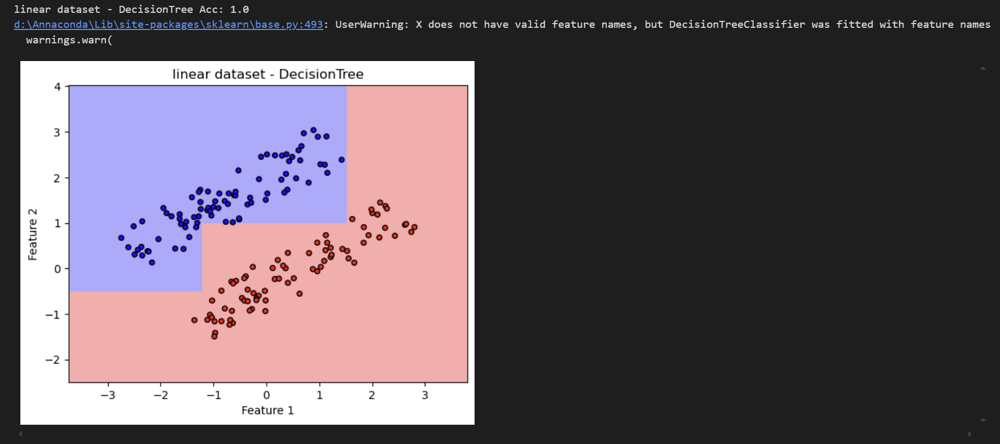

## 决策树解答

### 1. 以下关于决策树的说法错误的是：

A. 决策树选择具有更强分类能力的特征进行分裂。

B. 决策树只能处理分类问题，无法处理连续的回归问题。

C. 决策树可以解决非线性可分的分类问题。

D. 决策树的预测结果分布在叶子节点上。
解答：选择B；
      
选项A正确；决策树决策树通过信息增益、基尼系数等指标选择分类能力强的特征进行分裂。

选项B错误；决策树（CART算法）既能处理分类问题（分类树），也能处理回归问题（回归树），回归树的叶子节点输出连续值（如均值）。

选项C正确；决策树是非参数模型，根据数据的分布来选择合适的特征分类，通过多级分裂可构造复杂决策边界，解决非线性可分的分类问题。

选项D正确；预测结果由叶子节点的类别标签（分类）或数值（回归）决定。

---
### 2. 以下关于ID3算法的说法错误的是：

A. 由ID3算法构建的决策树，一个特征不会在同一条路径中出现两次。

B. 作为非参数化模型，ID3算法不会出现过拟合。

C. 在节点分裂出来的树枝数目取决于分类特征可能取值的数量。

D. 信息增益率为信息增益与熵之间的比值，可以排除特征本身复杂度的影响。
解答：选择B,D(B这么武断的结论欸，一看就不对);

选项A正确；ID3算法每个特征只会一条路径上出现一次，避免重复使用。
    
选项B错误；ID3算法通过递归分裂生成树，直到所有叶子节点纯度达到100%（或无法进一步分裂）。这种贪婪策略会导致树深度过大，对训练数据中的细节过度敏感，从而造成过拟合。哪有绝对的事物，对吧？
    
选项C正确；节点分裂树枝的数目取决于分类特征取值的数量。如果是分类问题，那么分类的类别就是树枝数，如果是回归问题，会对取值进行离散化处理，划分成不同的区间进行取值。

选项D错误；在ID3算法中仅使用了信息增益（基于熵的减少）作为特征选择标准，而信息增益率是 C4.5 引入的修正指标，用于解决信息增益对多值特征的偏好问题（信息增益率 = 信息增益 / 特征自身的熵）。

---
### 3. 设 $X$ 和 $Y$是相互独立的随机变量，证明：
  $$H(XY)=H(X)+H(Y) \\ H(XX)=H(X)$$  
其中 $H(XY)$ 表示变量 $X$ 和 $Y$ 的联合熵，是基于其联合分布 $p(X,Y)$ 而计算的。
解答：不许因为懒得证偷懒哈

证明方法(1):

**证明：**
    设 $X$ 和 $Y$ 是定义在概率空间 $(Ω, F,P)$ 上的随机变量，并且它们是相互独立的。我们要证明的是：
    
  $$H(XY)=H(X)+H(Y)$$
    
  $$H(XX) = H(X)$$

首先，我们先证明: 

$$H(XY)=H(X)+H(Y)$$

由于 $X$ 和 $Y$ 是独立的，它们的联合分布可以表示为边缘分布的乘积，即：

$$p(X=x,Y=y)=p(X=x)⋅p(Y=y)$$

熵的定义是：

$$H(Z)=-\sum_{x∈Z}p(z)\log p(z)$$

对于 $X$ $Y$ 的联合熵，我们有：

$$H(XY)=-\sum_{(x,y)∈ X · Y }p(X=x,Y=y)\log p(X=x,Y=y)$$

由于X和Y是独立的，我们可以将联合概率分解为边缘概率的乘积：

$$H(XY)=-\sum_{x∈X}\sum_{y∈Y}p(X=x)⋅p(Y=y)\log(p(X=x)⋅p(Y=y))$$

利用对数的性质，我们可以将上式拆分为两个对数的和：

$$H(XY)=-\sum_{x∈X}\sum_{y∈Y}p(X=x)·p(Y=y)\log(p(X=x)+p(Y=y))$$

由于$p(x,y)=p(x)⋅p(y)$，我们可以将求和项分开：

$$H(XY)=-\sum_{x∈X}\sum_{y∈Y}p(x)p(y)\log p(y) -\sum_{x∈X}\sum_{y∈Y} p(x)p(y)\log p(x)$$

加油......快证完了(困吧，我也困zzz)

注意到 $$\sum_{x∈X}p(x)=1$$ 和 $$\sum_{y∈Y}p(y)=1$$

所以可以得到：

$$H(XY)=-\sum_{x∈X}p(x)\log p(x) -\sum_{y∈Y}p(y)\log p(y)$$

Uh哈！眼不眼熟？熵的定义是什么来着？

所以:

$$H(XY)=H(X)+H(Y)$$

接下来证明: $$H(XX) = H(X)$$

对于 $XX$ ，我们知道 $X$ 与自身当然是独立的，所以 $XX$ 的分布与 $X$ 的分布是相同的。因此,我们可以直接写出:

$$H(XX)=-\sum_{x∈X}p(x)\log p(x)$$

这就是 $H(X)$ 熵的定义，秒了:

$$H(XX) = H(X)$$

由此，即可得证。(高中的时候真的觉得这六个字很帅)

---

偷懒的罚五毛哈

---

证明方法(2)(很像，但是这个比方法一稍微简单一些):

**证明：**

熵：

$H(X)=-\sum_{x}p(x)\log{p(x)}$  

联合熵：

$H(XY)=-\sum_{x}\sum_{y}p(x,y)\log{p(x,y)}$  

- 
$$
\begin{aligned} 
H(XY) 
&= -\sum_{x}\sum_{y} p(x,y) \log p(x,y) \\ 
&= -\sum_{x}\sum_{y} p(x)p(y) \log (p(x)p(y)) \\ 
&= -\sum_{x}\sum_{y} p(x)p(y) (\log p(x) + \log p(y)) \\ 
&= -(\sum_{x}p(x)\log p(x)\sum_{y}p(y))-(\sum_{y}p(y)\log p(y)\sum_{x}p(x)) \\
&其中\sum_{x}p(x) = \sum_{y}p(y) = 1 \\
&= -(\sum_{x} p(x) \log p(x)) - (\sum_{y} p(y) \log p(y)) \\ 
&= H(X) + H(Y) \end{aligned}
$$

  
$p(X,X)=p(X=x)p(X=x)=p(X)^2$

$$
\begin{align*}
H(XX) 
&= \sum_{x}\sum_{x}p(x,x)\log p(x,x) 
\end{align*}
$$

---

### 4. 在12.1节的例子中，计算用湿度为标准进行一次分类的信息增益和信息增益率。
解答：
- 用湿度分类：记湿度高为 $Y_H$，湿度中为 $Y_M$。
  - 湿度高样本8个，其中外出2个，未外出6个，得
    $$H(X|Y_H)=-\frac{6}{8}\log\frac{6}{8}-\frac{2}{8}\log\frac{2}{8}\approx 0.8113$$
  - 湿度中样本6个，外出5个，未外出1个，得
    $$H(X|Y_M)=-\frac{5}{6}\log\frac{5}{6}-\frac{1}{6}\log\frac{1}{6}\approx 0.6500$$
  - 条件熵
    $$H(X|Y)\approx H(X|Y_H)\times\frac{8}{14} + H(X|Y_M)\times\frac{6}{14}\approx 0.7422$$
  - 信息增益
    $$I(X|Y)\approx H(X)-H(X|Y)\approx 1-0.7422\approx 0.2578$$
  - 分布的熵
    $$H_Y(X) = -\frac{8}{14}\log\frac{8}{14}-\frac{6}{14}\log\frac{6}{14}\approx 0.9853$$
  - 信息增益率
    $$I_R(X,Y) = \frac{I(X|Y)}{H_Y(X)}\approx \frac{0.2578}{0.9853} \approx 0.2616$$

---
5. 在本章C4.5决策树代码的基础上实现CART分类树。
- 不纯度度量方法更改
  - C4.5：信息增益比
  - CART：基尼不纯度
- 节点分裂方法更改
  - C4.5：可分裂多个子节点
  - CART：二叉分裂，两个子节点
- 叶结点表示类别更改
  - C4.5：多个类别
  - CART：单一类别
- 剪枝策略更改
  - C4.5：预剪枝/后剪枝
  - CART：后剪枝
- other
  - 数据集分割（split_dataset）：根据特征和阈值将数据集分割成两个子集，这是CART决策树分裂过程中的一个关键步骤。

寻找最佳分裂点（find_best_split）：遍历所有特征和可能的阈值，寻找能够最大程度降低基尼不纯度的最佳分裂点。

构建决策树（build_tree）：递归地构建决策树，根据数据集的当前状态决定是继续分裂还是创建叶节点。

训练（fit）：通过调用build_tree方法来训练决策树。

预测（predict_instance 和 predict）：通过递归地遍历决策树来预测单个或多个样本的类别。

准确率计算（accuracy）：计算模型在给定数据集上的预测准确率。

```python

# 数据预处理代码
import numpy as np
import pandas as pd
from sklearn.model_selection import train_test_split
from sklearn.metrics import classification_report

# 读取数据
data = pd.read_csv('D:/Download/train.csv')
# 删去编号、姓名、船票编号3列
data.drop(columns=['PassengerId', 'Name', 'Ticket'], inplace=True)

# 处理Cabin特征：转换为是否存在的二值特征
data['Cabin'] = data['Cabin'].notna().astype(int)

feat_ranges = {}
cont_feat = ['Age', 'Fare']  # 连续特征
bins = 10  # 分箱数

# 处理连续特征分箱
for feat in cont_feat:
    # 计算分箱边界（忽略缺失值）
    min_val = data[feat].min(skipna=True)
    max_val = data[feat].max(skipna=True)
    bin_edges = np.linspace(min_val, max_val, bins + 1)
    
    # 分箱并替换原始数据
    data[feat] = pd.cut(data[feat], bins=bin_edges, labels=False, include_lowest=True)
    # 处理缺失值为-1
    data[feat] = data[feat].fillna(-1).astype(int)
    feat_ranges[feat] = [-1] + list(range(bins))

# 处理离散特征
cat_feat = ['Sex', 'Pclass', 'SibSp', 'Parch', 'Embarked']
for feat in cat_feat:
    # 转换为分类代码并处理缺失值
    data[feat] = data[feat].astype('category').cat.codes
    # 收集特征取值范围
    unique_values = data[feat].unique().tolist()
    unique_values.sort()
    feat_ranges[feat] = unique_values

# 确保所有缺失值已被处理
data.fillna(-1, inplace=True)

# 划分训练集与测试集（分层抽样）
X = data.drop(columns='Survived')
y = data['Survived']
train_x, test_x, train_y, test_y = train_test_split(
    X, y, test_size=0.2, stratify=y, random_state=0
)

print('训练集大小：', len(train_x))
print('测试集大小：', len(test_x))
print('特征数：', train_x.shape[1])
```


```python
# 定义优化的决策树类
class Node:
    __slots__ = ['feature_index', 'threshold', 'left_child', 'right_child', 'predicted_class']
    def __init__(self):
        self.feature_index = None
        self.threshold = None
        self.left_child = None
        self.right_child = None
        self.predicted_class = None

class OptimizedCARTDecisionTree:
    def __init__(self, max_depth=5, min_samples_split=10):
        self.max_depth = max_depth
        self.min_samples_split = min_samples_split
        self.tree = None
        self.T = 0

    def gini(self, Y):
        counts = np.bincount(Y)
        probabilities = counts / len(Y)
        return 1 - np.sum(probabilities ** 2)

    def find_best_split(self, X, Y):
        best_gini = float('inf')
        best_feature = None
        best_threshold = None

        for feature in range(X.shape[1]):
            # 获取唯一值并生成候选阈值
            values = X[:, feature]
            unique_values = np.unique(values)
            if len(unique_values) < 2:
                continue
            
            # 生成候选阈值（相邻值的中间点）
            thresholds = (unique_values[:-1] + unique_values[1:]) / 2
            
            for threshold in thresholds:
                left_mask = values <= threshold
                right_mask = ~left_mask
                
                # 跳过不满足最小样本数的分割
                if left_mask.sum() < self.min_samples_split or right_mask.sum() < self.min_samples_split:
                    continue
                
                # 计算基尼指数
                gini = (self.gini(Y[left_mask]) * left_mask.sum() +
                        self.gini(Y[right_mask]) * right_mask.sum()) / len(Y)
                
                if gini < best_gini:
                    best_gini = gini
                    best_feature = feature
                    best_threshold = threshold

        return best_feature, best_threshold

    def build_tree(self, X, Y, depth=0):
        # 终止条件
        if (len(np.unique(Y)) == 1 or
            (self.max_depth is not None and depth >= self.max_depth) or
            len(Y) < self.min_samples_split):
            leaf = Node()
            leaf.predicted_class = np.argmax(np.bincount(Y))
            self.T += 1
            return leaf
        
        # 寻找最佳分割
        feature, threshold = self.find_best_split(X, Y)
        if feature is None:
            leaf = Node()
            leaf.predicted_class = np.argmax(np.bincount(Y))
            self.T += 1
            return leaf
        
        # 分割数据集
        left_mask = X[:, feature] <= threshold
        right_mask = ~left_mask
        
        # 递归构建子树
        node = Node()
        node.feature_index = feature
        node.threshold = threshold
        node.left_child = self.build_tree(X[left_mask], Y[left_mask], depth+1)
        node.right_child = self.build_tree(X[right_mask], Y[right_mask], depth+1)
        
        return node

    def fit(self, X, Y):
        self.tree = self.build_tree(X, Y)
        
    def predict(self, X):
        return np.array([self._predict(x) for x in X])
    
    def _predict(self, x, node=None):
        if node is None:
            node = self.tree
        if node.predicted_class is not None:
            return node.predicted_class
        if x[node.feature_index] <= node.threshold:
            return self._predict(x, node.left_child)
        else:
            return self._predict(x, node.right_child)
    
    def accuracy(self, X, Y):
        return np.mean(self.predict(X) == Y)

# 训练并评估模型
DT = OptimizedCARTDecisionTree(max_depth=5, min_samples_split=10)
DT.fit(train_x.to_numpy(), train_y.to_numpy())

print('叶节点数量：', DT.T)
print('训练集准确率：', DT.accuracy(train_x.to_numpy(), train_y.to_numpy()))
print('测试集准确率：', DT.accuracy(test_x.to_numpy(), test_y.to_numpy()))
print('测试集报告：')
print("\n")
print(classification_report(test_y, DT.predict(test_x.to_numpy())))
```


6. 尝试将决策树应用到第11章支持向量机中用到的linear.csv和spiral.csv分类数据集上。先猜想一下分类效果与支持向量机相比如何，再用实验验证你的猜想。注意，需要先对连续特征离散化。
- 对于线性可分的数据，决策树和支持向量机比较好地划分数据，决策树有明显的折线，说明是树的形式划分的
- 对于线性不可分的数据，决策树和支持向量机不好划分数据。调参后能大概拟合。
- 离散化使得这两个数据集不适合训练，故没有离散化。

```python

import numpy as np
import pandas as pd
import matplotlib.pyplot as plt
from matplotlib.colors import ListedColormap
from sklearn.tree import DecisionTreeClassifier
from sklearn.svm import SVC
from sklearn.metrics import accuracy_score
from sklearn.model_selection import train_test_split

# 定义绘制决策边界函数
def plot_decision_boundary(model, X, y, title):
    cmap_light = ListedColormap(['#FFAAAA', '#AAFFAA', '#AAAAFF'])
    cmap_bold = ListedColormap(['#FF0000', '#00FF00', '#0000FF'])
    
    x_min, x_max = X[:, 0].min() - 1, X[:, 0].max() + 1
    y_min, y_max = X[:, 1].min() - 1, X[:, 1].max() + 1
    xx, yy = np.meshgrid(np.arange(x_min, x_max, 0.02), np.arange(y_min, y_max, 0.02))
    Z = model.predict(np.c_[xx.ravel(), yy.ravel()])
    Z = Z.reshape(xx.shape)
    
    plt.figure()
    plt.pcolormesh(xx, yy, Z, cmap=cmap_light)
    plt.scatter(X[:, 0], X[:, 1], c=y, cmap=cmap_bold, edgecolor='k', s=20)
    plt.xlim(xx.min(), xx.max())
    plt.ylim(yy.min(), yy.max())
    plt.title(title)
    plt.xlabel("Feature 1")
    plt.ylabel("Feature 2")
    plt.show()

# 加载数据
linear_data = pd.read_csv('D:/Download/linear.csv')
spiral_data = pd.read_csv('D:/Download/spiral.csv')

# 划分特征和标签
y_linear = linear_data.iloc[:, -1]
y_spiral = spiral_data.iloc[:, -1]

# 划分数据集为训练集和测试集
X_linear_train, X_linear_test, y_linear_train, y_linear_test = train_test_split(linear_data.iloc[:, :-1], y_linear, test_size=0.2, random_state=42)
X_spiral_train, X_spiral_test, y_spiral_train, y_spiral_test = train_test_split(spiral_data.iloc[:, :-1], y_spiral, test_size=0.2, random_state=42)

# 创建并训练DecisionTree模型
dt_linear = DecisionTreeClassifier(random_state=42)
dt_linear.fit(X_linear_train, y_linear_train)

dt_spiral = DecisionTreeClassifier(random_state=42)
dt_spiral.fit(X_spiral_train, y_spiral_train)

# 创建并训练支持向量机模型
svm_linear = SVC(kernel='linear', random_state=42)
svm_linear.fit(X_linear_train, y_linear_train)

svm_spiral = SVC(kernel='rbf', gamma=50, tol=1e-6, random_state=42)
svm_spiral.fit(X_spiral_train, y_spiral_train)

# 在测试集上进行预测并计算准确率
dt_linear_pred = dt_linear.predict(X_linear_test)
dt_linear_accuracy = accuracy_score(y_linear_test, dt_linear_pred)

dt_spiral_pred = dt_spiral.predict(X_spiral_test)
dt_spiral_accuracy = accuracy_score(y_spiral_test, dt_spiral_pred)

svm_linear_pred = svm_linear.predict(X_linear_test)
svm_linear_accuracy = accuracy_score(y_linear_test, svm_linear_pred)

svm_spiral_pred = svm_spiral.predict(X_spiral_test)
svm_spiral_accuracy = accuracy_score(y_spiral_test, svm_spiral_pred)

print("linear dataset - DecisionTree Acc:", dt_linear_accuracy)
plot_decision_boundary(dt_linear, X_linear_train.values, y_linear_train, title="linear dataset - DecisionTree")
print("linear dataset - SVM Acc:", svm_linear_accuracy)
plot_decision_boundary(svm_linear, X_linear_train.values, y_linear_train, title="linear dataset - SVM")
print("spiral dataset - DecisionTree Acc:", dt_spiral_accuracy)
plot_decision_boundary(dt_spiral, X_spiral_train.values, y_spiral_train, title="spiral dataset - DecisionTree")
print("spiral dataset - SVM Acc:", svm_spiral_accuracy)
plot_decision_boundary(svm_spiral, X_spiral_train.values, y_spiral_train, title="spiral dataset - SVM")
```



### 7. 假设在一个二维数据的二分类任务中，最优分类边界是$x_1-x_2=0$，但是决策树模型只能沿着坐标轴的方向去切分二维数据空间，这样耗费很多分裂节点也无法取得很好的分类性能，试思考在此类情形下应该如何应对。
解答：可以从三个角度出发：

1.特征变换：通过PCA(主成分分析)或者一些旋转等操作，将数据转换到新的坐标系统中，使得分类边界在新坐标系统中是轴对齐的。

2.改变处理方法: 在决策树的基础上，使用集成学习方法学习到多个模型后，通过voting(投票)、stacking(堆叠)或其他方式在非轴对齐边界上进行优化。

3.换个模型：实在不行的话，就换一个模型(SVM:支持向量机)、(GBDT:梯度提升决策树)等。

---
